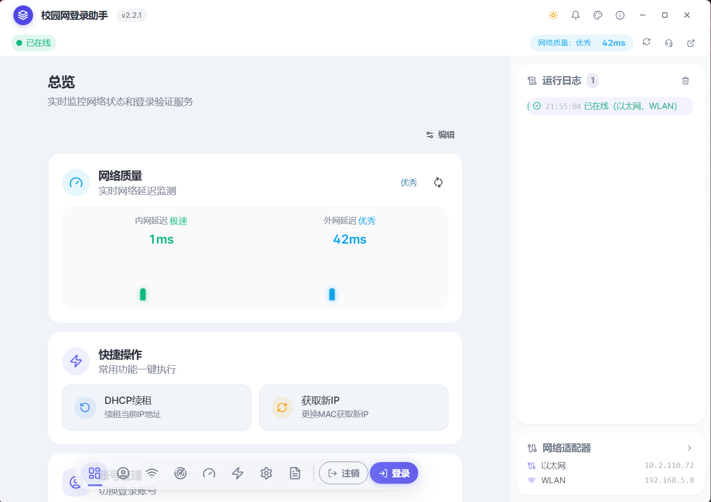

# Wxxy-CampusLogin

无锡学院校园网登录助手 — 基于 Tauri 2 + React 19 的桌面应用




<br />

## 功能特性

- **一键登录** — 自动检测网络适配器、DHCP 续租、智能重试
- **一键注销** — 两步注销：Radius 注销 + MAC 解绑，支持指定适配器或全部注销
- **自动重连** — 后台巡检断线检测，最多 3 次自动重连
- **校园网检测** — WiFi/有线独立检测：网络名称匹配 → /18 子网匹配 → 网关 Ping 可达，无网络时自动跳过退出等待恢复
- **DNS 智能解析** — 动态评分选择最优 DNS 服务器，应用级 DoH 解析，三级智能解析策略
- **DNS 优化** — 检测当前 DNS/DoH 配置，一键设置推荐 DNS + 启用 DoH 加密
- **网络质量监测** — 网关/DNS/DoH/HTTPS 延迟并发测试，DNS 解析专项测试
- **多账号管理** — DPAPI 加密存储、快速切换
- **双适配器支持** — 有线 + 无线同时管理，Dock 栏适配器选择菜单
- **开机自启** — 静默启动、自动登录、登录后自动退出
- **主题定制** — 6 种预设主题 + 自定义主题色 + 深浅模式
- **系统托盘** — 最小化到托盘后台运行，支持托盘快速登录
- **用户自助服务** — 一键打开校园网自助服务系统，查看流量使用等
- **中英语言切换** — 标题栏一键切换，默认中文，支持英文
- **日志自动清理** — 可选保存时间（3/7/14/30天+永久），后端定时清理过期日志

## 技术栈

| 层级 | 技术 |
|------|------|
| 框架 | Tauri 2 |
| 前端 | React 19 + TypeScript + Vite 6 |
| 样式 | TailwindCSS 3.4 + Framer Motion 12 + GSAP 3 |
| 后端 | Rust + Tokio |
| 网络 | reqwest 0.12 + tokio-rustls 0.26 + hickory-resolver 0.24 |
| 加密 | Windows DPAPI |
| 平台 | Windows (Win32 API) |
| 国际化 | react-i18next + i18next-browser-languagedetector |

## 项目结构

```
Wxxy-CampusLogin/
├── assets/                  # 截图等资源
├── tauri-app/
│   ├── frontend/            # React 前端
│   │   ├── src/
│   │   │   ├── components/  # UI 组件
│   │   │   │   ├── dialogs/ # 对话框
│   │   │   │   ├── layout/  # 布局组件（标题栏/状态栏/导航栏）
│   │   │   │   ├── panels/  # 面板组件
│   │   │   │   ├── shared/  # 共享组件
│   │   │   │   └── ui/      # 基础 UI 组件
│   │   │   ├── hooks/       # 状态管理 & IPC
│   │   │   ├── i18n/        # 国际化
│   │   │   │   └── locales/ # 语言文件（zh.json / en.json）
│   │   │   ├── lib/         # 工具函数
│   │   │   ├── types/       # TypeScript 类型
│   │   │   └── constants/   # 常量
│   │   └── package.json
│   └── src-tauri/           # Rust 后端
│       ├── src/
│       │   ├── commands/    # Tauri 命令（模块化拆分）
│       │   ├── network/     # 网络模块（适配器/DNS/质量检测/缓存/HTTP计时）
│       │   ├── config/      # 配置管理（model/persist/validate）
│       │   ├── auth/        # 认证模块（Portal检测/登录注销协议/会话管理）
│       │   ├── account/     # 账号模块（多账号管理 + crypto.rs DPAPI加密）
│       │   ├── monitor/     # 监控模块（后台巡检/自动登录/延迟测试/适配器监控）
│       │   ├── infra/       # 基础设施（状态管理/日志系统/生命周期/通知）
│       │   ├── platform/    # 平台交互（DNS配置/UAC提权/GPU检测/开机自启）
│       │   └── update/      # 更新模块（检查/下载/安装/SHA256校验）
│       ├── icons/           # 应用图标
│       ├── Cargo.toml
│       └── tauri.conf.json
└── CODE_WIKI.md             # 详细代码文档
```

## 开发环境搭建

### 前置要求

- [Node.js](https://nodejs.org/) >= 18
- [Rust](https://rustup.rs/) (stable)
- [Tauri 2 CLI](https://tauri.app/start/prerequisites/)

### 安装依赖

```bash
cd tauri-app/frontend
npm install

cd ..
npm install
```

### 开发模式

```bash
cd tauri-app
npx tauri dev
```

### 构建发布

```bash
cd tauri-app/frontend
npm run build

cd ../src-tauri
cargo build --release
```

## 安全说明

- 密码使用 Windows DPAPI 加密存储，绑定当前 Windows 用户
- 前端显示密码为 `***`，不暴露明文；保存时空密码不覆盖旧密码
- HTTP 客户端默认 TLS 1.3，回退 TLS 1.2
- DoH 解析使用 RFC 8484 wire format
- 更新安装包 SHA256 完整性校验，校验缺失时拒绝安装
- 适配器名称校验防止命令注入

## 致谢

本项目参考了 [Wxxy\_network\_auto\_login](https://github.com/Senquan007/Wxxy_network_auto_login) 的 Portal 认证逻辑与网络检测方案。

## 许可证

MIT License
