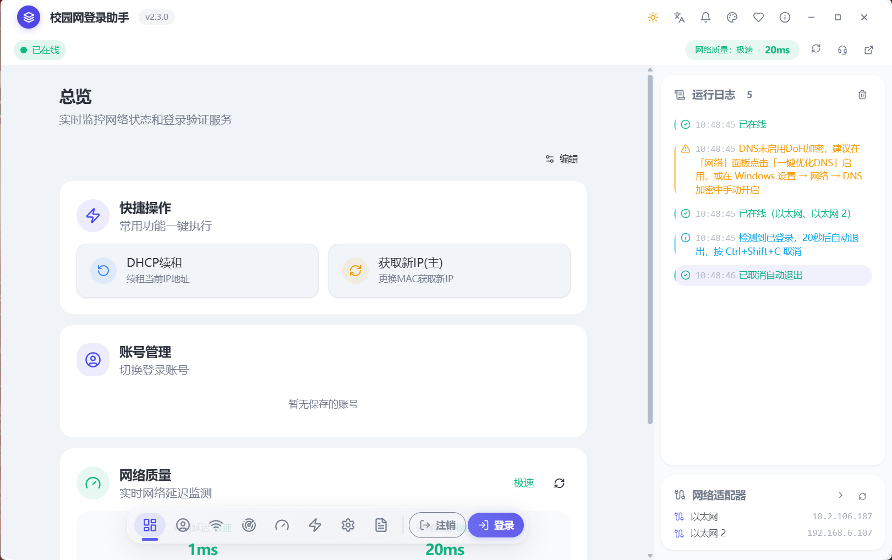

# Wxxy-CampusLogin

无锡学院校园网登录助手 — 基于 Tauri 2 + React 19 的 Windows 桌面应用




## 下载安装

前往 [Releases](https://github.com/ikliml666/Wxxy-CampusLogin/releases) 下载最新安装包（`Wxxy-CampusLogin_{版本}_x64-setup.exe`），双击安装即可。应用内置更新检查，新版本发布后会自动提示。

## 功能特性

- **一键登录** — 自动检测网络适配器、DHCP 续租、可重试失败智能重试
- **一键注销** — 两步注销：Radius 注销 + MAC 解绑，支持指定适配器或全部注销
- **自动重连** — 后台巡检断线检测，最多 3 次自动重连
- **自动退出** — 登录成功后倒计时自动退出，`Ctrl+Shift+C` 取消
- **校园网检测** — WiFi/有线独立检测：网络名称匹配 → /18 子网匹配 → 网关 Ping 可达，非校园网环境自动退出
- **DNS 智能解析** — 动态评分选择最优 DNS 服务器，应用级 DoH 解析（RFC 8484），三级智能解析策略
- **DNS 优化** — 检测当前 DNS/DoH 配置，一键设置推荐 DNS（IPv4/IPv6/双栈）+ 启用 DoH 加密
- **网络质量监测** — 网关/DNS/DoH/HTTPS 延迟并发测试，DNS 解析专项测试，结果增量推送；"网络拥堵"通知经 15s 间隔两次复核确认，避免瞬时抖动误报
- **双适配器支持** — 有线 + 无线同时管理，Dock 栏适配器选择菜单
- **多账号管理** — DPAPI 加密存储、快速切换
- **运营商账号绑定** — 对接校园网自助服务系统，绑定/查询运营商账号，绑定状态一目了然
- **Windows Hello 验证** — 查看运营商密码明文、踢设备下线等敏感操作需本地生物识别/PIN 验证，后端时效复核
- **自助服务查询** — 在线设备信息、近期上网记录（日期范围筛选 + 汇总统计），支持踢设备下线
- **总览自定义卡片** — 首页卡片可增删与拖拽排序，内置"在线信息"与"近期上网记录"卡（关键信息验证后查看）
- **主题定制** — 7 种预设主题 + 自定义主题色 + 深浅模式
- **系统托盘** — 最小化到托盘后台运行，支持托盘快速登录
- **开机自启** — 支持静默启动
- **日志管理** — 运行日志面板（级别/模块/关键词过滤），可按 3/7/14/30 天或永久自动清理
- **用户自助服务** — 一键打开校园网自助服务系统
- **中英语言切换** — 标题栏一键切换，默认中文

## 技术栈

| 层级 | 技术 |
|------|------|
| 框架 | Tauri 2 |
| 前端 | React 19 + TypeScript + Vite 6 |
| 样式 | TailwindCSS 3.4 + Framer Motion 12 + GSAP 3 |
| 后端 | Rust + Tokio |
| 网络 | reqwest 0.12 + tokio-rustls 0.26 + hickory-resolver 0.24 |
| 加密 | Windows DPAPI |
| 平台 | Windows (Win32/WinRT API, Windows Hello) |
| 国际化 | react-i18next + i18next-browser-languagedetector |

## 项目结构

```
Wxxy-CampusLogin/
├── assets/                  # 截图等资源
├── tauri-app/
│   ├── build.ps1            # 发布构建脚本（生成安装包 + .sha256）
│   ├── frontend/            # React 前端
│   │   ├── src/
│   │   │   ├── components/  # UI 组件
│   │   │   │   └── layout/  # 布局组件（标题栏/状态栏/Dock导航/右侧面板）
│   │   │   ├── auth/        # 认证面板（总览/关于对话框）
│   │   │   ├── account/     # 账号面板
│   │   │   ├── network/     # 网络面板（适配器/DNS 优化）
│   │   │   ├── monitor/     # 监控面板（状态/质量/延迟/测速）
│   │   │   ├── settings/    # 设置面板（主题/新手引导）
│   │   │   ├── shared/      # 共享组件（日志/错误边界/Toast/赞助浮层等）
│   │   │   ├── hooks/       # 状态管理（按领域拆分的 zustand store）& IPC & 初始化子 hook
│   │   │   ├── i18n/        # 国际化（zh.json / en.json）
│   │   │   ├── lib/         # 工具函数
│   │   │   └── App.tsx      # 根组件
│   │   └── package.json
│   └── src-tauri/           # Rust 后端
│       ├── src/
│       │   ├── commands/    # Tauri 命令（模块化拆分）
│       │   ├── network/     # 网络模块（适配器/DNS/质量检测/缓存/HTTP计时）
│       │   ├── config/      # 配置管理（model/persist/validate）
│       │   ├── auth/        # 认证模块（Portal检测/登录注销协议/会话管理）
│       │   ├── account/     # 账号模块（crypto.rs DPAPI 加密）
│       │   ├── monitor/     # 监控模块（后台巡检/自动登录/延迟测试/适配器监控）
│       │   ├── infra/       # 基础设施（状态管理/日志/事件总线/退出生命周期/通知）
│       │   ├── platform/    # 平台交互（DNS配置/UAC提权/GPU检测/开机自启/Windows Hello验证）
│       │   ├── helper/      # 提权辅助子进程（改 MAC/设 DNS，无 PowerShell 依赖）
│       │   ├── app/         # 应用生命周期（启动/托盘/窗口/快捷键/心跳）
│       │   └── update/      # 更新模块（检查/下载/安装/SHA256校验）
│       ├── icons/           # 应用图标
│       ├── Cargo.toml
│       └── tauri.conf.json
└── CODE_WIKI.md             # 详细代码文档
```

## 开发环境搭建

### 前置要求

- [Node.js](https://nodejs.org/) >= 18
- [Rust](https://rustup.rs/) (stable)
- [Tauri 2 CLI](https://tauri.app/start/prerequisites/)

### 安装依赖

```bash
cd tauri-app/frontend
npm install

cd ..
npm install
```

### 开发模式

```bash
cd tauri-app
npx tauri dev
```

### 构建发布

```bash
# 完整发布构建：前端打包 + Tauri 打包 + 生成 .sha256 校验文件
pwsh tauri-app/build.ps1
```

### 测试

项目包含后端 Rust 测试和前端 TypeScript 测试，CI 前请确保全部通过。

```bash
# 后端测试（246 个单元测试 + 1 个回归集成测试）
cd tauri-app/src-tauri
cargo test

# 后端 lint
cargo clippy --all-targets -- -D warnings

# 前端测试（74 个测试）
cd ../frontend
npm test

# 前端类型检查
npx tsc --noEmit --incremental
```

## 安全说明

- 密码使用 Windows DPAPI 加密存储，绑定当前 Windows 用户（登录密码与自助服务密码同措施）
- 前端显示密码为 `***`，不暴露明文；保存时空密码不覆盖旧密码；所有配置出站路径统一经后端掩码出口，明文不出后端
- 查看运营商账户密码明文需通过 Windows Hello 验证，后端校验验证时效（600 秒 TTL），绕过前端也无法获取明文
- HTTP 客户端默认 TLS 1.3，回退 TLS 1.2
- DoH 解析使用 RFC 8484 wire format
- 更新安装包 SHA256 完整性校验：校验源全部 4xx 时默认拒绝安装，5xx/传输错误/哈希不匹配一律拒绝
- 提权操作（改 MAC/设 DNS）由 Rust 直调 Win32/winreg，无 shell 拼接命令注入面；适配器名称额外做元字符校验
- 账号名校验防止路径遍历攻击
- 外部链接仅允许 http/https 白名单并限制长度

## 致谢

本项目参考了 [Wxxy\_network\_auto\_login](https://github.com/Senquan007/Wxxy_network_auto_login) 的 Portal 认证逻辑与网络检测方案。

## 许可证

MIT License
